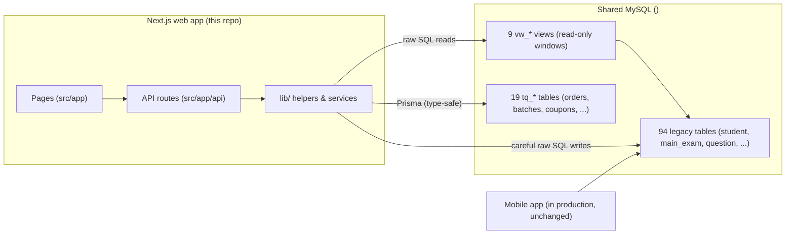

# 2. Architecture

> **What this file tells you:** how the web app, the database, and the mobile app fit together, and the patterns every API route in this codebase follows.

## The big picture

One Next.js application serves everything: the student website, the admin panel, the coaching-centre portal, and all API endpoints. It talks to one MySQL database, which it **shares with a mobile app that is live in production**.

## The two data layers

The single most important thing to understand about this codebase is that it talks to the database in **two different ways**:

1. **Prisma** (the type-safe database library) — used for all **`tq_*` tables**. These are new tables the web app owns outright. Models are defined in [prisma/schema.prisma](../../prisma/schema.prisma). Code looks like `prisma.order.create(...)`.
2. **Raw SQL** (`prisma.$queryRaw`) — used for all **legacy tables and views**. The legacy schema is never modelled in Prisma, so Prisma can never "migrate" (and accidentally destroy) it. Code looks like `` prisma.$queryRaw`SELECT * FROM vw_students WHERE id = ${id}` ``.

**Reads** of legacy content go through 9 views named `vw_*` (`vw_classes`, `vw_subjects`, `vw_questions`, `vw_question_options`, `vw_question_meta`, `vw_tests`, `vw_test_questions`, `vw_students`, `vw_attempts_legacy`). A view is a saved query that presents messy legacy tables with clean column names. Definitions: [prisma/migration/sql/create-views.sql](../../prisma/migration/sql/create-views.sql).

**Writes** are split by domain:

| Domain | Written to | Why |
|---|---|---|
| Student accounts (signup, profile) | Legacy `student` table | The mobile app logs students in from the same table |
| Content (classes, subjects, questions, tests) | Legacy tables | Single source of truth — the mobile app shows the same content |
| Test attempts and answers | Legacy `main_exam_status` + `main_exam_result` | A student's history is shared across web and mobile |
| Orders, coupons, bundles, paid access, coaching | New `tq_*` tables | Web-only features; the mobile app never sees them |

All the raw-SQL access is wrapped in five files so the rest of the codebase never writes SQL directly: [legacy-content.ts](../../src/lib/legacy-content.ts) (reads), [legacy-students.ts](../../src/lib/legacy-students.ts) (student accounts), [legacy-attempts.ts](../../src/lib/legacy-attempts.ts) (attempts), [legacy-admin.ts](../../src/lib/legacy-admin.ts) (admin content writes), [legacy-lookups.ts](../../src/lib/legacy-lookups.ts) (small shared lookups).

## How a request flows

Example — a student submits a test:

1. The page [src/app/attempts/[id]/page.tsx](../../src/app/attempts/%5Bid%5D/page.tsx) calls `POST /api/attempts/123/submit`.
2. The API route [src/app/api/attempts/[id]/submit/route.ts](../../src/app/api/attempts/%5Bid%5D/submit/route.ts) checks the login cookie (`requireAuth`), validates input with Zod, and calls a helper.
3. The helper [src/lib/legacy-attempts.ts](../../src/lib/legacy-attempts.ts) writes the result rows into the legacy tables with raw SQL.
4. The route returns JSON in the standard shape (below).

## Conventions every API route follows

- **Auth:** `getSession()` / `requireAuth("student" | "admin")` from [src/lib/auth.ts](../../src/lib/auth.ts). Sessions are stateless JWTs — there is no session table. Route protection also happens in [src/middleware.ts](../../src/middleware.ts).
- **Validation:** every route parses its input with a Zod schema. Bad input returns a clean 400.
- **Response shape:** always `{ ok: true, data: ... }` on success or `{ ok: false, error: ... }` on failure. Helpers live in [src/lib/api-utils.ts](../../src/lib/api-utils.ts).
- **BigInt handling:** MySQL views return BIGINT for computed columns; `api-utils.ts` patches JSON serialisation globally, and code casts view ids with `Number(r.id)` before passing them to Prisma.
- **Soft delete:** nothing is truly deleted. Legacy rows use `status = 0`; `tq_*` rows use `isActive = false`.
- **ID offset trick:** legacy "practice tests" and "main exams" live in different tables but share one URL space. Practice-test ids are exposed **offset by +1,000,000** so the code can tell them apart.

## Where things run

- **Production:** a Hostinger VPS runs `next start` under PM2 (a process manager that keeps the app alive), behind Nginx (the web server that terminates HTTPS and forwards to port 3000). Details: [09-deployment-operations.md](./09-deployment-operations.md).
- **Database:** remote shared MySQL at Hostinger (`<db-host>`) — the same database in development and production. **Be careful: there is no separate staging database.**
